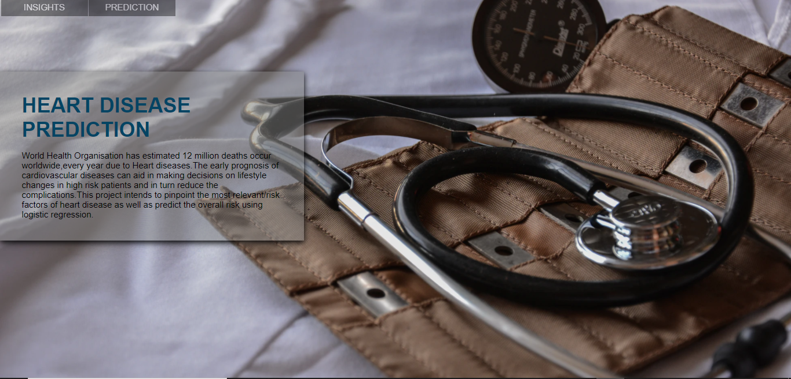

# Heart disease Prediction
The project was built to predict if a person is prone to get heart disease in next 10 years using a classification model.A UI was built for the project using Flask-Python.

### **Problem statement**

To predict whether a person has a risk of getting heart disease in the next 10 years

### **Data Description**
- Data is taken from kaggle.
- The Data set contains 16 columns and 4240 rows.
- It contains the features such as BMI, glucose, heart_rate, age, BP etc.

### **Project ppt**

https://prezi.com/view/wPQPKFG0eG0FEQz9yklQ/

### **Screenshot of the Project application**

